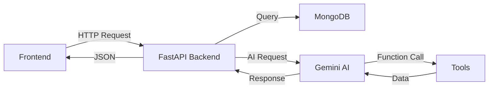

# 🌾 Krishi Mitra - Backend Architecture

## 📋 Overview
The backend is built with **FastAPI** and provides RESTful APIs for the Krishi Mitra agricultural platform. It features an **Agentic AI Chatbot** powered by Google's Gemini 2.5 Flash, MongoDB for data persistence, and specialized routers for different features.

---

## 🏗️ System Architecture

```
backend/
├── main.py                 # FastAPI app entry point
├── database.py             # MongoDB connection setup
├── tools.py                # Agentic AI tools (5 functions)
├── requirements.txt        # Python dependencies
├── .env                    # Environment variables (API keys)
├── models/                 # Pydantic data models
│   ├── chat.py            # Chat message models
│   └── women_empowerment.py # Women empowerment models
└── routers/               # API route handlers
    ├── chat_service.py    # Chatbot API endpoints
    ├── women_empowerment.py # Women farmer features
    ├── community.py       # LiveKit community features
    └── kisan_kendra.py    # Kisan Seva Kendra finder
```

---

## 🔑 Environment Variables (`.env`)

| Variable | Purpose | Example |
|----------|---------|---------|
| `GEMINI_API_KEY` | Google Gemini AI API key | `AIzaSy...` |
| `MONGODB_URL` | MongoDB Atlas connection string | `mongodb+srv://...` |
| `HF_TOKEN` | HuggingFace token (for ML models) | `hf_...` |
| `LIVEKIT_URL` | LiveKit WebSocket URL | `wss://...` |
| `LIVEKIT_API_KEY` | LiveKit API key | `API...` |
| `LIVEKIT_API_SECRET` | LiveKit API secret | `BlVs...` |

---

## 🧠 Core Components

### 1. **main.py** - Application Entry Point
- **Framework**: FastAPI with async support
- **CORS**: Configured for frontend (`allow_origins=["*"]`)
- **Lifespan**: MongoDB connection management (startup/shutdown)
- **Routers**: Includes 4 feature routers
- **Agentic Chat**: `/chat` endpoint with automatic function calling

**Key Endpoints:**
- `GET /` - Health check
- `POST /chat` - Agentic chatbot (legacy, use `/chat/message` instead)

---

### 2. **database.py** - MongoDB Setup
- **Driver**: Motor (async MongoDB driver)
- **Database**: `krishi_mitra`
- **SSL**: Uses `certifi` for TLS with `tlsAllowInvalidCertificates=True`
- **Collections**: Managed by individual routers

---

### 3. **tools.py** - Agentic AI Tools (5 Functions)

These are **function calling tools** that Gemini AI can invoke automatically:

| Tool | Purpose | Parameters | Returns |
|------|---------|------------|---------|
| `get_market_price` | Fetch mandi prices | `crop_name`, `location` | Price, trend, message |
| `get_government_schemes` | Find relevant schemes | `topic` | List of schemes with links |
| `get_weather_forecast` | 3-day weather forecast | `location` | Forecast + alerts |
| `recommend_crop` | Suggest best crops | `soil_type`, `season`, `location` | Crop recommendations |
| `diagnose_crop_disease` | Identify diseases | `symptoms` | Diagnosis + remedy |

**Example Tool Response:**
```json
{
  "crop": "Wheat",
  "location": "Punjab",
  "price_per_quintal": 2350,
  "trend": "up",
  "message": "The current price of Wheat in Punjab is ₹2350/quintal. Trend is up ↑."
}
```

---

## 🛣️ API Routers

### 1. **chat_service.py** (`/chat/*`)
Manages the AI chatbot with session-based conversations.

**Endpoints:**
- `POST /chat/new` - Create new chat session
- `POST /chat/message` - Send message (with image support)
- `POST /chat/transcribe` - Voice-to-text (Whisper API)
- `GET /chat/sessions/{user_id}` - Get user's chat sessions
- `GET /chat/history/{session_id}` - Get chat history

**MongoDB Collection:** `chat_sessions`

**Key Features:**
- Session management with MongoDB
- Image analysis (base64 upload)
- Multilingual support (Hindi, English, Marathi, Punjabi)
- Voice input transcription

---

### 2. **women_empowerment.py** (`/women/*`)
Features for women farmers.

**Endpoints:**
- `GET /women/schemes` - Government schemes for women
- `GET /women/training` - 6-week training program structure
- `POST /women/shg/register` - Register Self-Help Group
- `GET /women/shg/list` - List all SHGs

**MongoDB Collection:** `shg_registrations`

---

### 3. **community.py** (`/community/*`)
LiveKit-based video community features.

**Endpoints:**
- `POST /community/token` - Generate LiveKit access token

**Integration:** LiveKit Cloud for real-time video/audio

---

### 4. **kisan_kendra.py** (`/kisan-kendra/*`)
Find nearby Kisan Seva Kendras.

**Endpoints:**
- `GET /kisan-kendra/nearby` - Get nearby centers (mock data)

---

## 🤖 Agentic AI Configuration

**Model:** `gemini-2.5-flash-lite`

**System Instruction:**
```
You are 'Krishi Sathi', an expert AI agricultural advisor for Indian farmers.
- Multilingual: Respond in user's language
- Empathetic: Use respectful language
- Data-Driven: Use tools for real data
- Actionable: Give step-by-step advice
```

**Generation Config:**
- `temperature`: 0.4 (factual responses)
- `max_output_tokens`: 8192
- `enable_automatic_function_calling`: True

---

## 📦 Dependencies (`requirements.txt`)

```txt
fastapi
uvicorn
motor                # Async MongoDB driver
google-generativeai  # Gemini AI SDK
python-dotenv
certifi
pydantic
livekit              # Community video
```

---

## 🚀 Running the Backend

### 1. Install Dependencies
```bash
cd backend
pip install -r requirements.txt
```

### 2. Configure Environment
Create `.env` file with required API keys (see table above).

### 3. Start Server
```bash
uvicorn main:app --reload --host 0.0.0.0 --port 8000
```

**Server runs on:** `http://localhost:8000`

---

## 🔗 API Integration Flow



---

## 🗄️ MongoDB Collections

| Collection | Purpose | Key Fields |
|------------|---------|------------|
| `chat_sessions` | Store chat history | `session_id`, `user_id`, `messages[]`, `title` |
| `shg_registrations` | SHG registrations | `group_name`, `leader_name`, `location`, `members` |

---

## 🔒 Security Notes

- **CORS**: Currently set to `allow_origins=["*"]` for development. **Restrict in production.**
- **API Keys**: Never commit `.env` to Git. Use `.gitignore`.
- **MongoDB**: Uses TLS with `tlsAllowInvalidCertificates=True` (for development).

---

## 📝 API Response Format

All endpoints return JSON:

**Success:**
```json
{
  "status": "success",
  "data": { ... }
}
```

**Error:**
```json
{
  "detail": "Error message"
}
```

---

## 🧪 Testing

**Health Check:**
```bash
curl http://localhost:8000/
```

**Chat Test:**
```bash
curl -X POST http://localhost:8000/chat \
  -H "Content-Type: application/json" \
  -d '{"message": "What is the price of wheat in Punjab?"}'
```

---

## 📚 Additional Resources

- [FastAPI Docs](https://fastapi.tiangolo.com/)
- [Gemini AI Function Calling](https://ai.google.dev/docs/function_calling)
- [Motor (Async MongoDB)](https://motor.readthedocs.io/)
- [LiveKit Docs](https://docs.livekit.io/)

---

**Built with ❤️ by Team IIIT Bhagalpur (saurabh singh rajput && Nitesh kumar Verma)**
