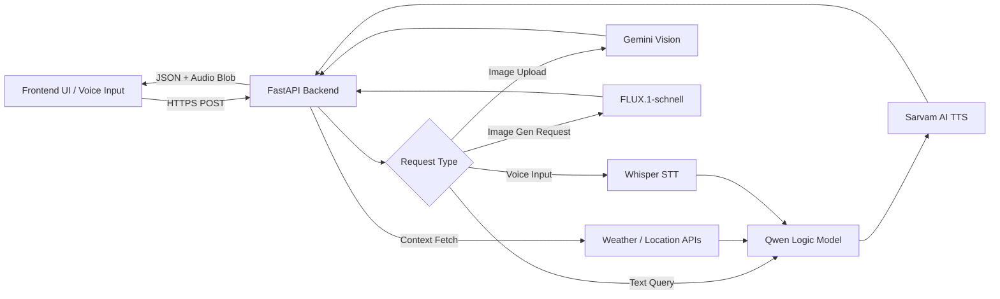

<div align="center">
  
  <h1>🌾 Krishi Mitra</h1>
  <p><strong>Empowering Indian Farmers with Next-Gen Multimodal AI</strong></p>

  <p>
    
    
    
    
    
  </p>
</div>

---

## 📋 Overview
**Krishi Mitra** is a comprehensive, AI-powered agricultural platform designed specifically for Indian farmers. It bridges the technology gap by offering a fully localized, voice-activated, and multimodal AI assistant ("Krishi Sathi") that provides real-time farming advice, diagnoses crop diseases from images, and even generates visual agricultural concepts. 

Beyond AI, the platform empowers rural communities with specialized tools for Women's Self-Help Groups (SHGs) and LiveKit-powered community video connections.

---

## ✨ Key Features

### 🤖 Multimodal AI Chatbot (Krishi Sathi)
- **🧠 Intelligent Advisories:** Powered by `Qwen 2.5` via Hugging Face for deep agricultural logic.
- **👁️ Crop Disease Vision:** Upload images of diseased crops; the system falls back to **Google Gemini 2.5 Flash** to diagnose the issue and suggest remedies.
- **🖼️ Text-to-Image Generation:** Ask the bot to draw a picture (e.g., "Draw a healthy wheat field") and it instantly generates gorgeous visuals using `FLUX.1-schnell`.
- **🎙️ Voice-First Interaction:** 
  - **Speech-to-Text:** Speak your queries natively using `openai/whisper-large-v3-turbo`.
  - **Text-to-Speech:** The bot talks back in regional languages (Hindi, Marathi, Punjabi, English) with native accents using **Sarvam AI**.

### 🌍 Context-Aware Intelligence
- **📍 Geolocation Integration:** Automatically fetches the user's location via frontend browser APIs.
- **🌤️ Live Weather Injection:** The LLM's system prompt is dynamically injected with real-time weather data (`Open-Meteo`) and location data (`BigDataCloud`), meaning the AI knows your local climate before it even answers!

### 👩🏽‍🌾 Women Empowerment & Community
- **SHG Registration:** Tools for women to form, register, and manage Self-Help Groups.
- **Training Modules:** Dedicated pathways for agricultural upskilling.
- **Live Video Community:** Real-time farmer-to-farmer communication powered by **LiveKit**.

---

## 🛠️ Tech Stack

### Frontend
- **Framework:** Next.js 14 (App Router)
- **Styling:** Tailwind CSS, Framer Motion (for smooth micro-animations)
- **Components:** Radix UI / shadcn/ui

### Backend
- **Framework:** FastAPI (Python)
- **Database:** MongoDB (Async Motor Engine)
- **AI/ML Integrations:** 
  - Hugging Face Inference API (`Qwen`, `FLUX.1`, `Whisper`)
  - Google Gemini API (`gemini-2.5-flash-lite` for vision)
  - Sarvam AI API (for regional Indic Text-to-Speech)
- **External APIs:** Open-Meteo, BigDataCloud

---

## 🏗️ Architecture Flow


```mermaid
graph LR
    A[Frontend UI / Voice Input] -->|HTTPS POST| B[FastAPI Backend]
    B --> C{Request Type}
    
    C -->|Voice Input| D[Whisper STT]
    C -->|Image Upload| E[Gemini Vision]
    C -->|Image Gen Request| F[FLUX.1-schnell]
    C -->|Text Query| G[Qwen Logic Model]
    
    B -->|Context Fetch| H[Weather / Location APIs]
    H --> G
    
    D --> G
    E --> B
    F --> B
    G --> I[Sarvam AI TTS]
    I --> B
    B -->|JSON + Audio Blob| A
```

---

## 🚀 Getting Started

### 1. Prerequisites
- Node.js (v18+)
- Python (v3.10+)
- MongoDB Atlas Account
- API Keys: Hugging Face, Gemini, Sarvam AI, LiveKit

### 2. Environment Variables
Create a `.env` file in the **`backend`** directory:
```ini
GEMINI_API_KEY="your_google_gemini_key"
MONGODB_URL="your_mongodb_connection_string"
HF_TOKEN="your_huggingface_token"
SARVAM_API_KEY="your_sarvam_ai_key"
LIVEKIT_URL="your_livekit_wss_url"
LIVEKIT_API_KEY="your_livekit_key"
LIVEKIT_API_SECRET="your_livekit_secret"
```

Create a `.env.local` file in the **`frontend`** directory:
```ini
NEXT_PUBLIC_API_URL="http://localhost:8000"
```

### 3. Installation

**Backend Setup:**
```bash
cd backend
python -m venv venv
source venv/bin/activate  # On Windows: venv\Scripts\activate
pip install -r requirements.txt
uvicorn main:app --reload --host 0.0.0.0 --port 8000
```

**Frontend Setup:**
```bash
cd frontend
npm install
npm run dev
```

The application will be running at `http://localhost:3000`.

---

## 🗄️ MongoDB Collections

| Collection | Purpose | Key Fields |
|------------|---------|------------|
| `chat_sessions` | Stores contextual chat history | `session_id`, `user_id`, `messages[]`, `title` |
| `shg_registrations` | Women's SHG registrations | `group_name`, `leader_name`, `location`, `members` |

---

## 📝 API Response Example (Chat)

```json
{
  "role": "assistant",
  "content": "यहाँ आपके लिए गेहूं के खेत का चित्र है।",
  "image": "data:image/jpeg;base64,/9j/4AAQSkZJRgABAQ..."
}
```

---

## 🤝 Built With ❤️ By

**Team IIIT Bhagalpur**
- Saurabh Singh Rajput 

<p align="center">
  <i>Empowering agriculture through technology.</i>
</p>

